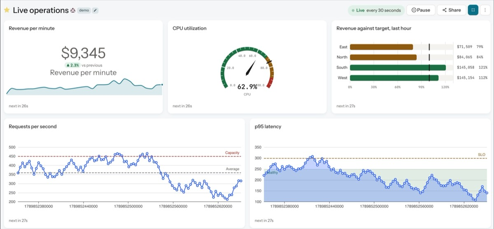

<div align="center">
  
  <h1>SQLDesk</h1>
  <p><strong>One place for everything you do with data.</strong></p>
  <p>Query 35+ data sources, build dashboards, and share what you find — self-hosted, no per-seat pricing.</p>
  <p>
    <a href="https://bot-netizen.github.io/sqldesk/">Website</a> &middot;
    <a href="CHANGELOG.md">Changelog</a> &middot;
    <a href="https://github.com/bot-netizen/sqldesk/discussions">Discussions</a>
  </p>
  <p>
    <a href="https://github.com/bot-netizen/sqldesk/actions/workflows/ci.yml"></a>
    <a href="LICENSE"></a>
    
  </p>
</div>

<div align="center">
  <a href="https://bot-netizen.github.io/sqldesk/#demo">
    
  </a>
  <p><em>A live dashboard, refreshed on the server every 30 seconds — nobody is pressing refresh.<br>
  <a href="https://bot-netizen.github.io/sqldesk/#demo">Watch the 15-second demo</a></em></p>
</div>

---

SQLDesk lets anyone connect to a data source, write a query, turn the result into a
visualization, and put it on a dashboard other people can use. SQL users get a fast
editor with schema browsing and scheduling; everyone else gets dashboards and alerts
built on that work.

It runs on your own infrastructure. Viewers are unlimited because there is nobody to
charge you for them.

## Features

- **Query editor** — schema browser, autocomplete, query formatting, parameters, scheduled refresh
- **35+ data sources** — PostgreSQL, MySQL, BigQuery, Snowflake, Databricks, Athena, ClickHouse, MongoDB, DuckDB and many more
- **File upload** — drop a CSV or Parquet file and query it with SQL, backed by DuckDB
- **Visualizations** — charts, tables, cohorts, funnels, maps, pivot tables
- **Dashboards** — arrange visualizations, filter across them, export to PDF or image
- **Alerts** — trigger on a query result and notify Slack, email, PagerDuty, webhooks and more
- **Permissions** — groups, per-data-source access, view-only roles, shareable public links

## Running it

Published images are at `ghcr.io/bot-netizen/sqldesk`, built for amd64 and arm64.
SQLDesk needs Postgres and Redis alongside it, and `compose.prod.yaml` wires up
all three:

```bash
cp .env.example .env
```

Fill in the three secrets it asks for, then:

```bash
docker compose -f compose.prod.yaml run --rm server create_db
docker compose -f compose.prod.yaml up -d
```

SQLDesk comes up on `http://localhost:5000`. Set `SQLDESK_IMAGE` in `.env` to
pin a different tag.

> On macOS, port 5000 is taken by AirPlay Receiver and `up` fails with "address
> already in use". Set `SQLDESK_PORT` and `SQLDESK_HOST` in `.env` to another
> port, or turn AirPlay Receiver off under System Settings > General > AirDrop
> & Handoff.

> Keep `SQLDESK_SECRET_KEY`. Data-source passwords are encrypted with it, so
> changing it makes every stored credential unreadable.

## Developing

`compose.yaml` is the development setup — it builds from source and mounts the
working tree, so edits are picked up without rebuilding.

```bash
make env               # generate .env with generated secrets
make compose_build     # build the images
make create_database   # create the schema (once)
make up                # start redis, postgres, server, worker, scheduler
```

That comes up on `http://localhost:5001`.

For the frontend:

```bash
pnpm install --frozen-lockfile
pnpm start             # webpack dev server + viz-lib watch
```

## Configuration

SQLDesk reads `SQLDESK_*` environment variables. If you are migrating an existing
Redash deployment, your `REDASH_*` variables are still honoured as a fallback — an
explicitly set `SQLDESK_*` always wins.

SQLDesk does not phone home. Version checking is off unless you set
`SQLDESK_VERSION_CHECK_URL` to an endpoint you control.

## Tests

```bash
make test              # backend + frontend + lint
pnpm test              # frontend only (type-check + jest)
docker compose run --rm server tests   # backend only
```

## Architecture

- **Backend** — `sqldesk/` (Python 3.13, Flask, SQLAlchemy, RQ)
- **Frontend** — `client/` (React, TypeScript, Webpack, Ant Design)
- **Visualizations** — `viz-lib/` (`@sqldesk/viz`, its own pnpm workspace package)

Workers, the scheduler and the web server are separate processes, so changes to task
logic need the worker restarted, not just the server.

## Licence

SQLDesk is licensed under the [Apache License 2.0](LICENSE).

SQLDesk is a fork of [Redash](https://github.com/getredash/redash), which is
copyright (c) 2013-2020 Arik Fraimovich and licensed under BSD 2-Clause. That licence
and its copyright notice are preserved in [LICENSE.redash](LICENSE.redash) and apply
to all inherited code. See [NOTICE](NOTICE) for full attribution.

SQLDesk is an independent project. It is not affiliated with, endorsed by, or
supported by the Redash project or its contributors.
